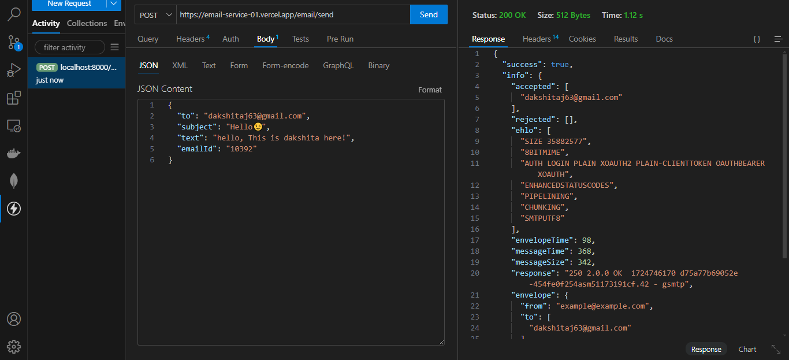
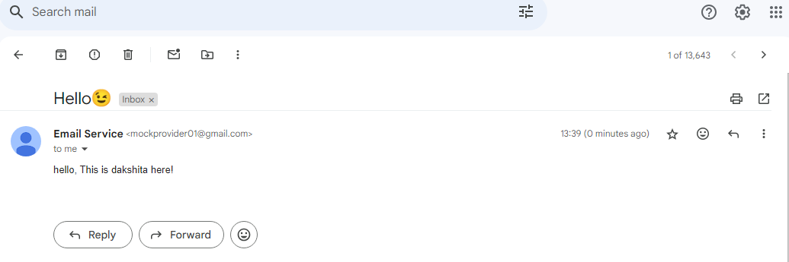

# Resilient Email Service

## Overview

This project implements a resilient email sending service using Node.js, Nodemailer, and Express.js. It features retry logic with exponential backoff, fallback between providers, idempotency, rate limiting, and basic status tracking. The implementation follows SOLID principles and includes a simple logging mechanism and a Circuit Breaker pattern.

## Features

- **Retry Mechanism**: Automatically retries sending emails with a configurable retry limit.
- **Fallback Mechanism**: Switches between multiple email providers on failure.
- **Idempotency**: Prevents duplicate email sends using a unique ID.
- **Rate Limiting**: Limits the number of email requests per IP address.
- **Status Tracking**: Logs successes and failures for monitoring.

## Prerequisites

- Node.js (version 14.x or later)
- npm (Node Package Manager)

## Setup Instructions

1. **API Endpoint**

   Use the following endpoint to send an email:

   - **Endpoint**: `https://email-service-01.vercel.app/email/send`
   - **Method**: `POST`
   - **Content-Type**: `application/json`

2. **Request Body Format**

   When submitting the email form, the `req.body` should be structured as follows:

   - **to**: The recipient's email address.  
     **Type**: `string`  
     **Format**: email address
   - **subject**: The subject of the email.  
     **Type**: `string`
   - **text**: The body text of the email.  
     **Type**: `string`
   - **emailId**: A unique identifier for the email to prevent duplicate sends.  
     **Type**: `string` (e.g., timestamp or UUID)

   ### Example of `req.body` object:

   ```json
   {
     "to": "recipient@example.com",
     "subject": "Test Email",
     "text": "This is a test email message.",
     "emailId": "1633024800000"
   }
   ```

  

## Result 

